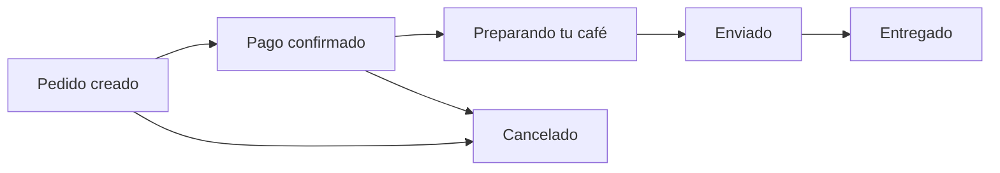

The `Order` collection type records every customer purchase. Orders do **not** use the draft/publish workflow — every created order is immediately live and visible to authenticated users with appropriate permissions.

<Note>
  Both `products` and `addressShiping` store **snapshots** of the data at the time of purchase. This ensures historical accuracy even if the originals are later modified or deleted.
</Note>

## Fields

<ResponseField name="id" type="integer" required>
  Auto-generated unique identifier assigned by Strapi.
</ResponseField>

<ResponseField name="idPayment" type="string">
  A UUID generated at order creation, used to reference the payment transaction. This is typically the identifier returned by the payment gateway and can be used to reconcile orders with payment provider records.

  Example: `"3f7b2c1a-84e0-4d29-b3f5-91ac620d7e88"`
</ResponseField>

<ResponseField name="totalPayment" type="decimal" required>
  The total amount charged for the order, in the store's base currency unit. This value is captured at checkout and does not change if product prices are later updated.
</ResponseField>

<ResponseField name="products" type="json" required>
  A JSON array containing a **snapshot** of the products at the time of purchase. Each item in the array includes product details (title, price, quantity, etc.) as they were when the order was placed.

  Storing a snapshot rather than a relation preserves the exact order contents even if products are subsequently edited or removed from the catalog.

  <Expandable title="Example products snapshot">

  ```json
  [
    {
      "id": 1,
      "title": "Espresso Blend 250g",
      "price": 1800,
      "discount": 10,
      "quantity": 2,
      "slug": "espresso-blend-250g"
    },
    {
      "id": 4,
      "title": "Cold Brew Kit",
      "price": 3200,
      "discount": 0,
      "quantity": 1,
      "slug": "cold-brew-kit"
    }
  ]
  ```

  </Expandable>
</ResponseField>

<ResponseField name="addressShiping" type="json" required>
  A JSON object containing a **snapshot** of the shipping address at the time of purchase, copied from the customer's selected [Address](/data-models/address) entry.

  Storing a copy ensures the delivery address on record cannot change if the user later edits their saved address.

  <Expandable title="Example address snapshot">

  ```json
  {
    "title": "Home",
    "name": "Maria Garcia",
    "address": "Calle 123 #45-67",
    "city": "Bogotá",
    "state": "Cundinamarca",
    "postalCode": "110111",
    "phone": "3001234567",
    "dialCode": "+57"
  }
  ```

  </Expandable>
</ResponseField>

<ResponseField name="state" type="enumeration">
  The current fulfillment state of the order. See the [order state machine](#order-state-machine) below for valid values and transitions.
</ResponseField>

<ResponseField name="user" type="relation (oneToOne → User)">
  Reference to the `users-permissions` plugin user who placed the order. Used to associate orders with a specific customer account.

  <Expandable title="User relation fields">
    <ResponseField name="user.id" type="integer">
      The user's unique identifier.
    </ResponseField>
    <ResponseField name="user.email" type="string">
      The user's email address.
    </ResponseField>
    <ResponseField name="user.username" type="string">
      The user's username.
    </ResponseField>
  </Expandable>
</ResponseField>

## Order state machine

The `state` field tracks where an order is in the fulfillment pipeline. States are stored in Spanish as enumeration values.



| State (stored value) | English meaning | Description |
|----------------------|-----------------|-------------|
| `Pedido creado` | Order created | Order has been placed. Awaiting payment confirmation. |
| `Pago confirmado` | Payment confirmed | Payment was successfully processed. |
| `Preparando tu café` | Preparing your coffee | The order is being picked, roasted, or packaged. |
| `Enviado` | Shipped | The order has been dispatched and is on its way to the customer. |
| `Entregado` | Delivered | The order has been received by the customer. |
| `Cancelado` | Cancelled | The order was cancelled. Can occur from `Pedido creado` or `Pago confirmado` states. |

<Warning>
  There is no automated state transition. Order state must be updated manually via the Strapi admin panel or through an authenticated API request.
</Warning>

## Example response

```json
{
  "id": 42,
  "idPayment": "3f7b2c1a-84e0-4d29-b3f5-91ac620d7e88",
  "totalPayment": "5800.00",
  "state": "Pago confirmado",
  "products": [
    {
      "id": 1,
      "title": "Espresso Blend 250g",
      "price": 1800,
      "discount": 10,
      "quantity": 2,
      "slug": "espresso-blend-250g"
    },
    {
      "id": 4,
      "title": "Cold Brew Kit",
      "price": 3200,
      "discount": 0,
      "quantity": 1,
      "slug": "cold-brew-kit"
    }
  ],
  "addressShiping": {
    "title": "Home",
    "name": "Maria Garcia",
    "address": "Calle 123 #45-67",
    "city": "Bogotá",
    "state": "Cundinamarca",
    "postalCode": "110111",
    "phone": "3001234567",
    "dialCode": "+57"
  },
  "user": {
    "id": 7,
    "email": "maria@example.com",
    "username": "maria_garcia"
  },
  "createdAt": "2025-03-01T14:32:00.000Z",
  "updatedAt": "2025-03-01T15:10:00.000Z"
}
```
